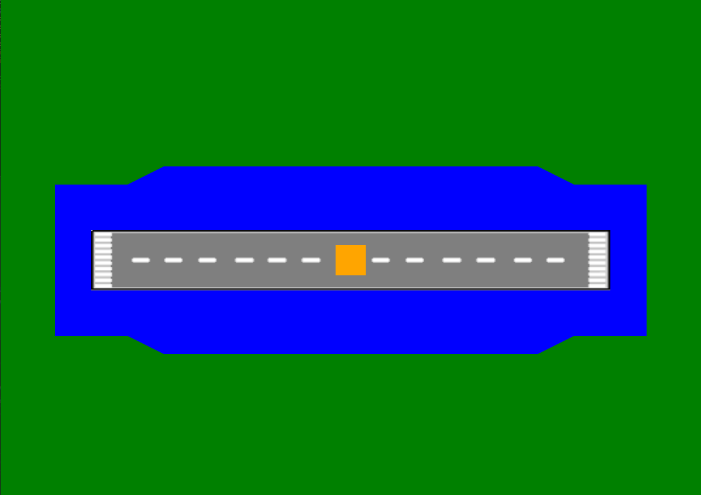
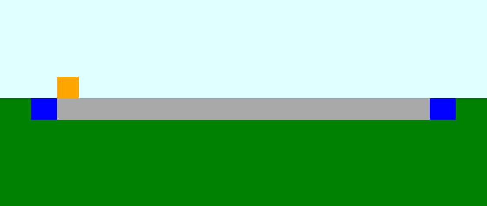

# SEG Project

This is a clone of the repository for our group project coursework created in the module Software Engineering Group Project, in which we practiced agile methodologies for the first time.

The aim of this project was to create a program to recalculate specifications for airport runways in the event of an obstruction on the runway.

Java was chosen due to familiarity of the language and the JavaFX library.

## Visuals

Below are images of the generated visualisations of the runway.

